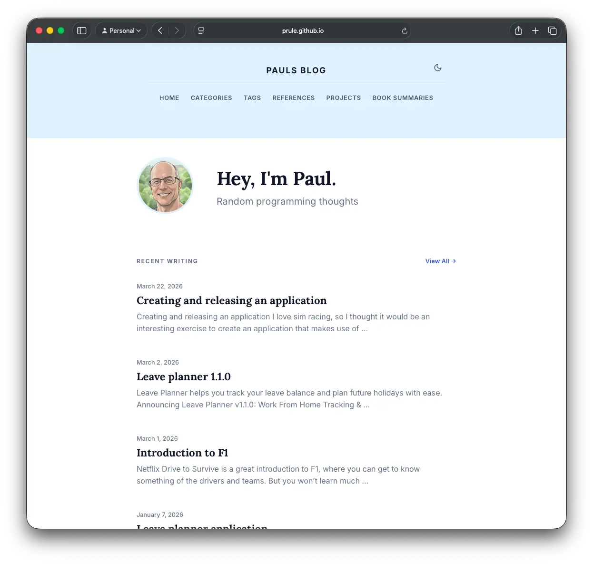
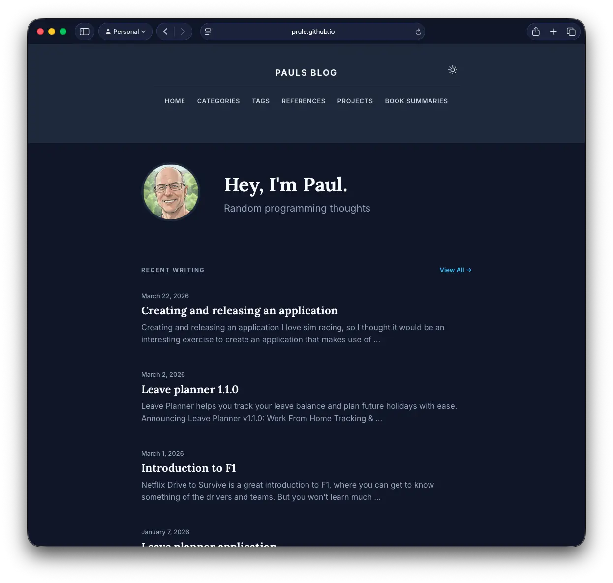
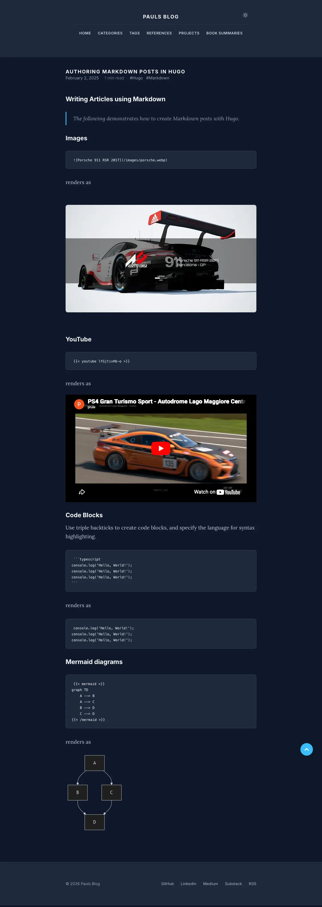
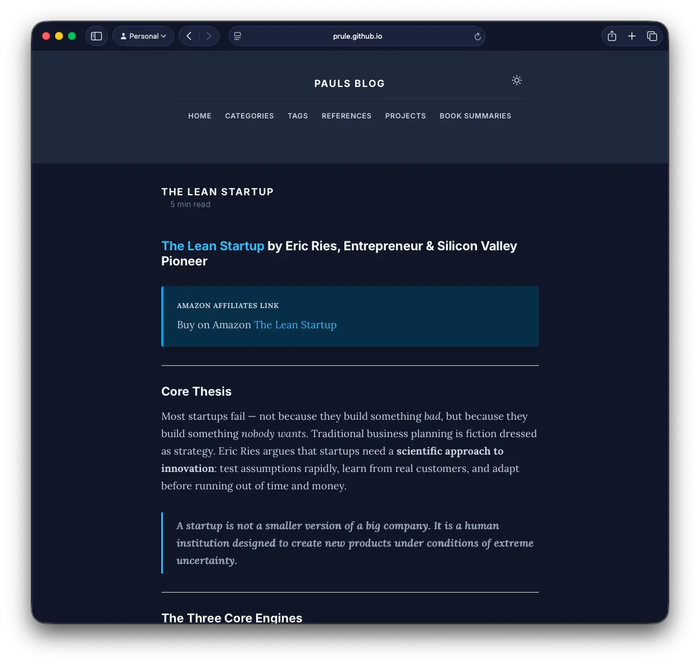

# Hugo Simple Beauty Theme

A minimalist, clean, and highly readable Hugo theme designed for personal blogs, book summaries, and technical writing.


## Features

### 🎨 Design & UI
- **Minimalist Aesthetic**: Focuses on typography and whitespace for an editorial feel.
- **System-based Dark Mode**: Automatically respects OS preferences with a dedicated manual toggle.
- **Responsive**: Fully optimized for mobile, tablet, and desktop.
- **Typography**: Uses the modern **Inter** font for UI and the elegant **Lora** serif for long-form reading.
- **Smooth Interaction**: Built-in smooth scrolling and subtle transitions.

### 🛠 Technical Features
- **Adaptive Syntax Highlighting**: Custom-themed code blocks that adjust colors for light and dark modes.
- **Related Writing**: Built-in engine suggests related posts based on tags and categories.
- **Reading Time**: Automatically calculates and displays the estimated reading time for each post.
- **SEO & Analytics**: Pre-configured with Google Analytics, Open Graph, Twitter Cards, and Canonical URLs.
- **Back to Top**: A smart floating button that appears as you scroll.
- **Conditional JS Loading**: External libraries (like Mermaid) are only loaded on pages that actually use them.

### 🧩 Shortcodes

#### Notices / Callouts
Beautifully styled boxes for `info` or `warning` messages.
```markdown

Your content here...

```

#### Mermaid Diagrams
Render flowcharts, sequence diagrams, and more using Mermaid.
```markdown

graph TD
    A[Start] --> B{Working?}
    B -- Yes --> C[Celebrate]
    B -- No --> D[Debug]

```

#### Center Text
Center any text or Markdown content.
```markdown

This text will be centered.
**You can even use Markdown inside!**

```

## Installation

1. From the root of your Hugo site, add the theme as a git submodule:
   ```bash
   git submodule add https://github.com/prule/hugo-simple-beauty.git themes/hugo-simple-beauty
   ```
2. Update your `hugo.toml` (or `config.toml`) to use the theme:
   ```toml
   theme = "hugo-simple-beauty"
   ```

## Configuration

### Table of Contents (TOC)
The theme supports an automatic, responsive Table of Contents for single posts, generated from your markdown headings (H2, H3 by default). On desktop, it appears as a sticky sidebar on the right; on mobile, it's displayed at the top of the content.

To enable the TOC globally for all single posts, add the following to your `hugo.toml` under the `[params]` section:
```toml
[params]
  showTableOfContents = true
```

You can override this setting for individual pages in their front matter:
- To **disable** TOC for a specific page (even if globally enabled):
  ```yaml
  ---
  title: "My Post"
  showTableOfContents: false
  ---
  ```
- To **enable** TOC for a specific page (even if globally disabled):
  ```yaml
  ---
  title: "My Other Post"
  showTableOfContents: true
  ---
  ```

### Extension Partials
The theme provides several "extension" partials that you can override in your project's `layouts/partials/` directory. This allows you to inject custom HTML, CSS, or JavaScript without modifying the theme's core files, making theme updates easier.

To use them, simply create a file with the corresponding name in your project's `layouts/partials/` directory (e.g., `layouts/partials/head-extend.html`). Hugo will automatically use your version instead of the empty one provided by the theme.

- **`head-extend.html`**: Injected just before the closing `</head>` tag. Ideal for custom CSS `<style>` blocks, `<link>` tags for external stylesheets, or `<script>` tags for JavaScript that needs to run early.
- **`footer-extend.html`**: Injected just before the closing `</footer>` tag. Useful for adding extra content to the footer area.
- **`body-before-close.html`**: Injected just before the closing `</body>` tag. Perfect for JavaScript that should run after the DOM is loaded, such as analytics scripts or custom interactive elements.

### Main Menu
Configure your navigation in `hugo.toml`:
```toml
[[menu.main]]
    name = "Home"
    url = "/"
    weight = 1
[[menu.main]]
    name = "Projects"
    url = "/projects"
    weight = 2
```

### Social Links & Avatar
Add your profiles and profile picture under `[params]`:
```toml
[params]
    description = "Software Developer & Reader"
    sidebar_avatar = "/images/profile.jpg"
    
    # Social
    github = "https://github.com/..."
    linkedin = "https://linkedin.com/in/..."
    medium = "https://medium.com/@..."
    substack = "https://your.substack.com"
```

### Google Analytics
Add your GA4 Measurement ID in `hugo.toml`:
```toml
[services.googleAnalytics]
    ID = 'G-XXXXXXXXXX'
```

### SEO & Social Sharing
The theme is optimized for search engines and social media platforms out of the box.

- **JSON-LD Structured Data**: Automatically generates `WebSite` (home) and `BlogPosting` (posts) schema to help search engines understand your content and enable rich results.
- **Open Graph & Twitter Cards**: 
    - Uses the `image` field in your post's front matter for sharing previews.
    - Falls back to `params.sidebar_avatar` if no post image is defined.
    - Automatically switches to `summary_large_image` when a post image is present.
- **Twitter Handle**: Add your Twitter handle (without the `@`) to `hugo.toml` to enable the `twitter:creator` tag:
  ```toml
  [params]
    twitter = "your_handle"
  ```

### Syntax Highlighting
Ensure your highlighter is configured to use classes:
```toml
[markup.highlight]
    noClasses = false
```

## Content Structure
- **Sections**: Use `_index.md` in folders (like `booksummaries/`) to create section landing pages.
- **Dates**: If a date is not specified in front matter, it will be hidden automatically (perfect for "Page" content).
- **Tags/Categories**: Use these in your front matter to power the "Related Writing" section.

## License
MIT

## Screenshots







